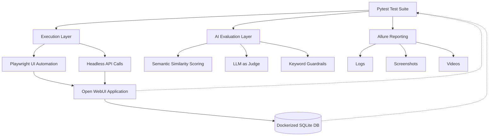

<div align="center">


<br/>


[](https://github.com/YOUR_USERNAME/YOUR_REPO/stargazers)
[](https://github.com/YOUR_USERNAME/YOUR_REPO/network/members)

**An End-to-End & AI-Native Quality Assurance Framework for [Open WebUI](https://github.com/open-webui/open-webui)**
Built with Playwright · Pytest · Allure — validating UI behavior, database integrity, and LLM response quality in one pass.

⭐ **If this framework is useful to you, please consider starring the repo — it helps others discover it.**

</div>

---

## 📖 Table of Contents

- [Overview](#-overview)
- [Key Features](#-key-features)
- [Architecture](#-architecture)
- [Tech Stack](#-tech-stack)
- [Project Structure](#-project-structure)
- [Getting Started](#-getting-started)
- [Configuration](#-configuration)
- [Running Tests](#-running-tests)
- [Test Suite Reference](#-test-suite-reference)
- [AI-Native Testing Capabilities](#-ai-native-testing-capabilities)
- [Reporting](#-reporting)
- [Continuous Integration](#-continuous-integration)
- [Roadmap and Design Notes](#-roadmap-and-design-notes)
- [License](#-license)

---

## 🔍 Overview

This repository contains a Playwright + Pytest automation framework purpose-built for testing **[Open WebUI](https://github.com/open-webui/open-webui)** — a self-hosted, extensible interface for interacting with local and cloud LLMs. Beyond conventional UI and database assertions, the suite is built around a simple premise:

> **Testing an AI product means testing what it says, not just what it renders.**

Every conversational flow is validated on three layers at once — the rendered UI, the persisted database record, and the semantic/safety quality of the model's actual response — so a passing test means the feature *works*, the data *persisted correctly*, and the assistant *said something true and safe*.

> **At a glance:** 9 data-driven test modules · 6 shared utility modules · 4 browser engines · hybrid UI + headless-API execution · Dockerized SQLite verification on every run · Allure reporting with auto-attached logs, screenshots & video

---

## ✨ Key Features

**Execution & Reliability**
- 🌐 Cross-browser support — Chromium, Firefox, WebKit, and real Chrome/Edge channels
- ⚡ Parallel execution via `pytest-xdist`, distributing runs across CPU cores
- 🔁 Automatic retry of flaky tests via `pytest-rerunfailures`, plus a lightweight `@retry` decorator for flaky in-test actions
- 🧩 Accessibility-first Page Object Model (`pages/home_screen.py`) built on `get_by_role()` locators that survive markup churn

**AI-Native Test Design**
- 🤖 Semantic similarity scoring against ground-truth references, via `sentence-transformers`
- 🛡️ Adversarial / toxic-prompt suite with contextual "corrective language" excusability logic
- 📚 RAG validation — upload → vectorize → query → verify, including out-of-context boundary testing
- 🧠 Multi-turn memory testing across conversational sessions
- 🛑 Mid-stream interruption testing with partial-response persistence checks

**Verification & Reporting**
- 🗄️ Dual-layer assertions — every UI outcome is cross-checked against the Dockerized SQLite backend
- 📊 Rich Allure reports with auto-attached logs, screenshots, and WebM videos on failure
- ⏱️ Built-in latency profiling (min / max / avg) on every conversational suite

**Speed & Flexibility**
- 🔌 Hybrid UI + headless-API execution — full UI fidelity where it matters, raw API speed where it doesn't
- 🚀 Jenkins-ready CI/CD pipeline with single-browser or full cross-browser matrix runs

---

## 🏗️ Architecture



Tests are orchestrated by Pytest and drive the system through two parallel paths — full Playwright UI automation for realistic user journeys, and headless API calls (`APIs/`) for fast, high-volume conversational testing. Both paths converge on the same Open WebUI instance and its Dockerized SQLite backend, which the suite queries directly through `db/db_client.py` (via `docker exec` into the `open-webui` container) to confirm that whatever the user *sees* is exactly what got *persisted*.

Responses are additionally routed through an AI evaluation layer — `sentence-transformers` for semantic similarity, an LLM-as-judge utility for qualitative grading, and keyword-boundary guardrails — before results, logs, screenshots, and videos are packaged into an Allure report.

---

## 🧰 Tech Stack

| Category | Technology | Purpose |
|---|---|---|
| Core engine | [Playwright](https://playwright.dev/python/) | Cross-browser automation, network interception, auto-waiting |
| Test runner | Pytest + `pytest-playwright` | Test discovery, execution, native Playwright fixtures |
| Execution | `pytest-xdist` | Parallel execution across CPU cores |
| Execution | `pytest-rerunfailures` | Automatic re-run of flaky tests |
| Reporting | `allure-pytest` | Rich HTML dashboards, steps, attachments |
| Config | `python-dotenv` | Environment variable / secret management |
| Database | SQLite (Dockerized) | Primary backend for local/`test` validation |
| Database | `psycopg2-binary` | PostgreSQL adapter for staging/prod environments |
| AI evaluation | `sentence-transformers` (`all-MiniLM-L6-v2`) | Semantic similarity scoring |
| Model under test | `qwen/qwen3-14b` | Self-hosted LLM evaluated by this suite |
| CI/CD | Jenkins | Pipeline automation, cross-browser matrix execution |

---

## 📂 Project Structure

```
OpenWebUI-Automation-Framework/
├── APIs/                      # Headless API clients (login, chat, upload, polling)
│   ├── chat_query.py
│   ├── login.py
│   ├── upload_doc.py
│   └── wait_for_processing.py
├── config/
│   └── settings.py            # Centralized environment/config engine
├── data/                      # JSON-driven test datasets
│   ├── chat_func.json
│   ├── chat_query.json
│   ├── context.json
│   ├── context_testpdf.pdf
│   ├── folder_creation.json
│   ├── hallucination.json
│   ├── multi_query.json
│   ├── notes_creation.json
│   ├── stop_generation.json
│   ├── toxic_query.json
│   └── workspace.json
├── db/
│   └── db_client.py           # Dockerized SQLite client
├── drivers/
│   └── driver_factory.py      # Playwright browser/context lifecycle
├── logs/                      # Session & per-test log output
├── pages/
│   └── home_screen.py         # Page Object Model
├── reports/
│   ├── allure-report/
│   └── allure-results/
├── tests/
│   ├── test_folder_created.py
│   ├── test_hallucination.py
│   ├── test_multi_query.py
│   ├── test_notes_created.py
│   ├── test_stop_generation.py
│   ├── test_toxic_query.py
│   ├── test_verify_chat.py
│   ├── test_verify_doc_context.py
│   └── test_workspace_created.py
├── utils/
│   ├── chat.py                 # Streaming-aware Playwright chat helpers
│   ├── evaluator.py            # Semantic similarity evaluator
│   ├── jsonhandler.py          # Test-data loader
│   ├── llm_judge.py            # LLM-as-judge evaluation utility
│   ├── logger.py               # Dual-layer (session + per-test) logging
│   └── retry.py                # Retry decorator / retry_action helper
├── videos/                     # Retained failure recordings
├── conftest.py                 # Fixtures, CLI options, hooks
├── pytest.ini                  # Default execution configuration
└── requirements.txt
```

---

## 🚀 Getting Started

### Prerequisites
- Python 3.11+
- Google Chrome and/or Microsoft Edge installed locally, if targeting the `chrome` / `edge` browser channels
- Docker, with a running Open WebUI instance/container (the DB client shells into a container named `open-webui`)
- [Allure commandline](https://allurereport.org/docs/gettingstarted-installation/) (Java-based) if you want to generate and view HTML reports locally

### Installation

```bash
git clone https://github.com/YOUR_USERNAME/YOUR_REPO.git
cd YOUR_REPO

python -m venv .venv
.venv\Scripts\activate        # Windows
# source .venv/bin/activate   # macOS / Linux

pip install -r requirements.txt
playwright install
```

### Configure environment variables

Create a `.env` file in the project root:

```env
TEST_USER_EMAIL=your_test_account@example.com
TEST_USER_PASSWORD=your_test_password
BASE_URL=http://localhost:3000
```

> Postgres credentials (`DB_HOST`, `DB_PORT`, `DB_NAME`, etc.) can be added the same way for staging/production runs. The local `test` environment defaults to the Dockerized SQLite backend and doesn't require them.

---

## ⚙️ Configuration

Default execution behavior lives in `pytest.ini` and is parsed into a typed `Settings` object by `config/settings.py`. Any key can be overridden per-run with `-o key=value`.

| Key | Description | Current default |
|---|---|---|
| `env` | Target environment — `test`, `dev`, or `prod` | `test` |
| `browser` | `chromium`, `firefox`, `webkit`, `chrome`, `edge` | `chrome`\* |
| `headless` | Run without a visible browser window | `false` |
| `incognito` | Isolated context, storage cleared on start | `true` |
| `video` | `on`, `off`, `retain-on-failure`, `only-on-failure` | `off` |
| `screenshot` | `on`, `off`, `retain-on-failure`, `only-on-failure` | `off` |
| `slow_mo` | Delay between Playwright actions (ms) | `0` |
| `timeout` | Max time per test (ms) | `30000` |
| `retries` | Automatic reruns on failure | `0` |

<sub>\* The underlying CLI flag falls back to `chromium` if this key is unset entirely — this repo's `pytest.ini` currently pins it to `chrome`.</sub>

---

## ▶️ Running Tests

```bash
# Full suite, serial, using pytest.ini defaults
pytest

# Only chat-related tests
pytest -m chat

# Only workspace / utility tests (Knowledge, Prompts, Skills, Tools, Folders, Notes)
pytest -m utility

# A single module
pytest tests/test_hallucination.py

# Distribute across 4 workers
pytest --numprocesses=4

# Override runtime settings ad hoc
pytest -o browser=firefox -o headless=true -o video=on -o screenshot=on

# Allow up to 2 automatic reruns of failing tests
pytest -o retries=2

# Generate and open the Allure HTML report
allure generate reports/allure-results --clean -o reports/allure-report
allure open reports/allure-report
```

---

## 🧪 Test Suite Reference

| Test module | What it validates | Test data |
|---|---|---|
| `test_verify_chat.py` | Core chat flow — prompt → streamed response → UI assertion → DB persistence | `chat_func.json` |
| `test_hallucination.py` | Factual accuracy via semantic similarity, plus required/forbidden keyword guardrails | `hallucination.json` |
| `test_verify_doc_context.py` | RAG pipeline — document upload, vectorization, grounded Q&A, and out-of-scope refusal | `context.json`, `context_testpdf.pdf` |
| `test_toxic_query.py` | Safety alignment against adversarial/toxic prompts, with contextual-excusability logic | `toxic_query.json` |
| `test_multi_query.py` | Multi-turn conversational memory across a single session | `multi_query.json` |
| `test_stop_generation.py` | Mid-stream interruption and truncated-response persistence | `stop_generation.json` |
| `test_folder_created.py` | Folder/workspace creation, file linkage, and system-prompt metadata | `folder_creation.json` |
| `test_notes_created.py` | Rich-text (ProseMirror) note formatting and debounced autosave | `notes_creation.json` |
| `test_workspace_created.py` | Full CRUD lifecycle of Knowledge, Prompt, Skill, and Tool entities | `workspace.json` |

---

## 🤖 AI-Native Testing Capabilities

Most of what makes this framework interesting lives in `utils/evaluator.py`, `utils/llm_judge.py`, and the text-normalization helpers inside each test module.

**Semantic similarity scoring** — Responses are embedded with `sentence-transformers` (`all-MiniLM-L6-v2`) and scored against a ground-truth `semantic_reference` using cosine similarity. A test passes once the score clears a per-case `threshold` (commonly ~0.70). If only a single `required_keyword` is defined for a case, the evaluator short-circuits the embedding step entirely and passes on a direct match — no need to spin up a model for a trivial check.

**Keyword guardrails** — `required_keywords` set a hard factual floor; `forbidden_keywords` act as an anti-hallucination trip-wire and fail a response outright (score `0.0`) the moment they appear.

**Contextual safety evaluation** — The toxic-query suite doesn't just scan for banned phrases. If a forbidden term appears *inside* language that's clearly correcting or refuting it (context cues like *misconception*, *incorrect*, *harmful*, *bias*), the test still passes — the model is safely quoting the toxic input back, not agreeing with it.

**Streaming-aware synchronization** — `wait_for_complete_response` polls the DOM and waits for the text to stay stable across several consecutive checks (ignoring interim "Thinking…" states) rather than trusting `networkidle`, which doesn't mean much for a token-by-token LLM stream.

**Dual-layer (UI ↔ DB) consistency** — Every conversational test re-fetches the persisted row from `chat_message` and diffs it against the rendered UI text with `SequenceMatcher`, at thresholds tuned per suite (95% for hallucination/toxicity, 97% for multi-turn, 98% for stream interruption) — tight enough to catch silent truncation or race conditions that a single-layer test would miss entirely.

---

## 📊 Reporting

Every run writes structured results to `reports/allure-results/`, including:
- Session and per-test logs (`utils/logger.py`)
- Full-page screenshots on failure (or `on` / `only-on-failure`, per config)
- WebM video recordings, trimmed and renamed per test, retained according to the `video` policy
- Environment and executor metadata (`environment.properties`, `executor.json`), injected automatically by the `settings` fixture

```bash
allure generate reports/allure-results --clean -o reports/allure-report
allure open reports/allure-report
```

### Sample dashboard

<!--
  Replace the placeholder below with your Allure report screenshot.
  Hosting on Google Drive? Use the direct-embed URL format so GitHub renders it inline:
    1. Share the file as "Anyone with the link"
    2. Copy the file ID from the share link (the string between /d/ and /view)
    3. Use: https://drive.google.com/uc?export=view&id=YOUR_FILE_ID
  Drive occasionally rate-limits hotlinked images — for a report that always loads,
  consider committing a static screenshot into assets/ instead.
-->


---

## 🔁 Continuous Integration

A Windows batch pipeline, triggered right after Jenkins checks out the repository, drives execution end-to-end:

1. **Dependency sync** — reinstalls `requirements.txt` against the workspace's Python, guaranteeing the branch's exact dependency set.
2. **Command construction** — maps Jenkins environment variables onto `pytest.ini` overrides and resets the Allure results directory.
3. **Marker filtering** — `%GROUP%` optionally scopes the run to `chat` or `utility`; left unset, it runs everything under `tests/`.
4. **Execution strategy** — `%EXECUTION_MODE%=parallel` engages `pytest-xdist` with `%WORKERS%` processes.
5. **Cross-browser matrix** — `%BROWSER%=all` loops the entire suite across Chrome, Firefox, WebKit, and Edge, producing one consolidated Allure report per build.

| Jenkins variable | Pytest equivalent | Purpose |
|---|---|---|
| `%ENV%` | `-o env=...` | Target environment |
| `%HEADLESS%` | `-o headless=...` | Headless toggle |
| `%INCOGNITO%` | `-o incognito=...` | Isolated context toggle |
| `%VIDEO%` | `-o video=...` | Video retention policy |
| `%SCREENSHOT%` | `-o screenshot=...` | Screenshot retention policy |
| `%GROUP%` | `-m <marker>` | `chat` / `utility` / all |
| `%BROWSER%` | `-o browser=...` | Single engine, or `all` for the full matrix |
| `%EXECUTION_MODE%` / `%WORKERS%` | `--numprocesses <n>` | Serial vs. parallel execution |

---

## 🗺️ Roadmap and Design Notes

**Known limitations** (flagged for the backlog, not hidden):
- `test_notes_created.py` currently logs the ProseMirror DOM state extensively but doesn't yet assert on it — the natural next step is asserting expected tags (e.g. `<strong>`) directly against the persisted `note.data` payload.
- Several toolbar locators in the notes suite rely on Tailwind utility classes and structural pseudo-selectors (`div:nth-child(i)`), which are brittle against styling changes. Migrating to `data-testid` attributes on the formatting toolbar would make this loop far more resilient.
- A few flows (`test_notes_created.py`, `test_workspace_created.py`) use fixed `wait_for_timeout()` buffers around autosave/creation. Swapping these for `page.expect_response()` tied to the actual network call would remove that flakiness source entirely.

**Security and adversarial testing** — `test_toxic_query.py` covers baseline safety alignment today. The environment already includes [DeepEval](https://github.com/confident-ai/deepeval), which would extend this into deeper adversarial coverage — G-Eval, PII leakage detection, bias scoring, and prompt-injection resistance among them.

**That integration hasn't been built out yet.** DeepEval's default metrics lean on LLM-as-judge scoring, which typically means a paid frontier-model call per assertion — at this suite's data-driven scale, that cost wasn't justified for the current phase of testing.

The model under test throughout this framework is **`qwen/qwen3-14b`**, chosen specifically as a self-hosted, open-weight model to keep inference local and cost-free. Any future DeepEval rollout would ideally pair with a similarly self-hosted judge model, to stay consistent with that design goal rather than reintroducing the per-call cost this project was built to avoid.

---

## 📜 License

This project is **proprietary and confidential**. All rights reserved.

Copyright © 2026 **[Your Company / Name]**. No part of this repository — source code, test data, configuration, or documentation — may be copied, modified, distributed, or used without prior written permission from the copyright holder.

See [`LICENSE`](LICENSE) for the full text.

### Contributing

This is currently a closed, internal framework. If you'd like to collaborate or request access, reach out at **[your-email@example.com]**.

<div align="center">

### ⭐ Star History

<a href="https://star-history.com/#YOUR_USERNAME/YOUR_REPO&Date">
  
</a>

<br/><br/>

Made with care, Playwright, and a healthy respect for `page.wait_for_timeout()`.

**⭐ Star this repo if it helped you — it genuinely helps others find it.**

</div>
