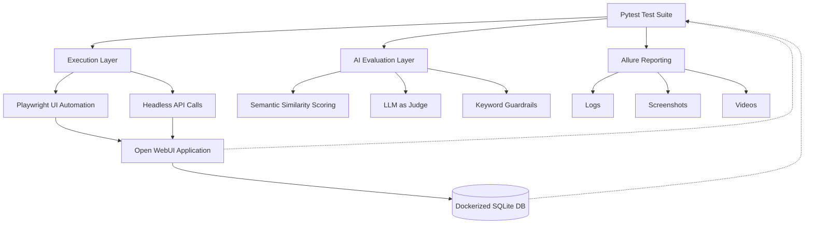

<div align="center">


<br/>


[](https://github.com/YOUR_USERNAME/YOUR_REPO/stargazers)
[](https://github.com/YOUR_USERNAME/YOUR_REPO/network/members)

**An End-to-End & AI-Native Quality Assurance Framework for [Open WebUI](https://github.com/open-webui/open-webui)**
Built with Playwright · Pytest · Allure — validating UI behavior, database integrity, and LLM response quality in one pass.

⭐ **If this framework is useful to you, please consider starring the repo — it helps others discover it.**

</div>

---

## 📖 Table of Contents

- [Overview](#-overview)
- [Key Features](#-key-features)
- [Architecture](#-architecture)
- [Tech Stack](#-tech-stack)
- [Project Structure](#-project-structure)
- [Getting Started](#-getting-started)
- [Configuration](#-configuration)
- [Running Tests](#-running-tests)
- [Test Suite Reference](#-test-suite-reference)
- [AI-Native Testing Capabilities](#-ai-native-testing-capabilities)
- [Reporting](#-reporting)
- [Continuous Integration](#-continuous-integration)
- [Roadmap and Design Notes](#-roadmap-and-design-notes)
- [License](#-license)

---

## 🔍 Overview

This repository contains a Playwright + Pytest automation framework purpose-built for testing **[Open WebUI](https://github.com/open-webui/open-webui)** — a self-hosted, extensible interface for interacting with local and cloud LLMs. Beyond conventional UI and database assertions, the suite validates the product on three levels at once: rendered UI, persisted data, and semantic response quality.

> **At a glance:** 9 data-driven test modules · 6 shared utility modules · 4 browser engines · hybrid UI + headless API execution · Dockerized SQLite verification on every run · Allure reporting with logs, screenshots, and video attachments.

---

## ✨ Key Features

**Execution & Reliability**
- 🌐 Cross-browser support — Chromium, Firefox, WebKit, and real Chrome/Edge channels.
- ⚡ Parallel execution via `pytest-xdist`, distributing runs across CPU cores.
- 🔁 Automatic retry of flaky tests via `pytest-rerunfailures`, plus a lightweight `@retry` decorator for flaky in-test actions.
- 🧩 Accessibility-first Page Object Model (`pages/home_screen.py`) built on `get_by_role()` locators that survive markup churn.

**AI-Native Test Design**
- 🤖 Semantic similarity scoring against ground-truth references, via `sentence-transformers`.
- 🛡️ Adversarial and toxic-prompt coverage with contextual corrective-language logic.
- 📚 RAG validation — upload, vectorize, query, and verify, including out-of-context boundary testing.
- 🧠 Multi-turn memory testing across conversational sessions.
- 🛑 Mid-stream interruption testing with partial-response persistence checks.

**Verification & Reporting**
- 🗄️ Dual-layer assertions — every UI outcome is cross-checked against the Dockerized SQLite backend.
- 📊 Rich Allure reports with auto-attached logs, screenshots, and WebM videos on failure.
- ⏱️ Built-in latency profiling for conversational suites.

**Speed & Flexibility**
- 🔌 Hybrid UI + headless API execution — full UI fidelity where it matters, raw API speed where it doesn't.
- 🚀 Jenkins-ready CI/CD pipeline with single-browser or full cross-browser matrix runs.

---

## 🏗️ Architecture



Tests are orchestrated by Pytest and executed through two parallel paths: full Playwright UI automation for realistic user journeys, and headless API calls for faster conversational checks. Both paths converge on the same Open WebUI instance and its Dockerized SQLite backend, which the suite queries directly through `db/db_client.py` to verify that what the user sees is what is persisted.

Responses are then evaluated through semantic similarity scoring, LLM-as-judge grading, and keyword guardrails before being packaged into Allure reports.

---

## 🧰 Tech Stack

| Category | Technology | Purpose |
|---|---|---|
| Core engine | [Playwright](https://playwright.dev/python/) | Cross-browser automation, network interception, auto-waiting |
| Test runner | Pytest + `pytest-playwright` | Test discovery, execution, native Playwright fixtures |
| Execution | `pytest-xdist` | Parallel execution across CPU cores |
| Execution | `pytest-rerunfailures` | Automatic re-run of flaky tests |
| Reporting | `allure-pytest` | Rich HTML dashboards, steps, attachments |
| Config | `python-dotenv` | Environment variable and secret management |
| Database | SQLite (Dockerized) | Primary backend for local/test validation |
| Database | `psycopg2-binary` | PostgreSQL adapter for staging and production |
| AI evaluation | `sentence-transformers` (`all-MiniLM-L6-v2`) | Semantic similarity scoring |
| Model under test | `qwen/qwen3-14b` | Self-hosted LLM evaluated by this suite |
| CI/CD | Jenkins | Pipeline automation and browser matrix execution |

---

## 📂 Project Structure

```text
OpenWebUI-Automation-Framework/
├── APIs/                              # Headless API clients (login, chat, upload, polling)
│   ├── chat_query.py
│   ├── login.py
│   ├── upload_doc.py
│   └── wait_for_processing.py
├── config/
│   └── settings.py                    # Centralized environment/config engine
├── data/                              # JSON-driven test datasets
│   ├── chat_func.json
│   ├── chat_query.json
│   ├── context.json
│   ├── context_testpdf.pdf
│   ├── folder_creation.json
│   ├── hallucination.json
│   ├── multi_query.json
│   ├── notes_creation.json
│   ├── stop_generation.json
│   ├── toxic_query.json
│   └── workspace.json
├── db/
│   └── db_client.py                   # Dockerized SQLite client
├── drivers/
│   └── driver_factory.py              # Playwright browser/context lifecycle
├── logs/                              # Session and per-test log output
├── pages/
│   └── home_screen.py                 # Page Object Model
├── reports/
│   ├── allure-report/
│   └── allure-results/
├── tests/
│   ├── test_folder_created.py
│   ├── test_hallucination.py
│   ├── test_multi_query.py
│   ├── test_notes_created.py
│   ├── test_stop_generation.py
│   ├── test_toxic_query.py
│   ├── test_verify_chat.py
│   ├── test_verify_doc_context.py
│   └── test_workspace_created.py
├── utils/
│   ├── chat.py                        # Streaming-aware Playwright chat helpers
│   ├── evaluator.py                   # Semantic similarity evaluator
│   ├── jsonhandler.py                 # Test-data loader
│   ├── llm_judge.py                   # LLM-as-judge evaluation utility
│   ├── logger.py                      # Dual-layer logging
│   └── retry.py                       # Retry decorator / retry_action helper
├── videos/                            # Retained failure recordings
├── conftest.py                        # Fixtures, CLI options, hooks
├── pytest.ini                         # Default execution configuration
└── requirements.txt
```

---

## 📊 Reporting

Every run writes structured results to `reports/allure-results/`, including logs, screenshots, videos, and environment metadata.

### Sample dashboard

[Allure Dashboard](https://drive.google.com/file/d/10O-haOrciADqkgllIlJd-BhRA07Z9Qje/view?usp=drive_link)

[System Architecture](https://drive.google.com/file/d/1mY5UKGmaKjOww83TgGZoNNfBIi-M49Vo/view?usp=drive_link)

[](https://star-history.com/#YOUR_USERNAME/YOUR_REPO&Date)

---

## 🔁 Continuous Integration

A Windows batch pipeline triggered after Jenkins checks out the repository drives execution end-to-end:

1. **Dependency sync** — reinstalls `requirements.txt` against the workspace Python.
2. **Command construction** — maps Jenkins environment variables onto `pytest.ini` overrides and resets the Allure results directory.
3. **Marker filtering** — `%GROUP%` optionally scopes the run to `chat` or `utility`.
4. **Execution strategy** — `%EXECUTION_MODE%=parallel` enables `pytest-xdist` with `%WORKERS%` processes.
5. **Cross-browser matrix** — `%BROWSER%=all` loops the suite across Chrome, Firefox, WebKit, and Edge.

| Jenkins variable | Pytest equivalent | Purpose |
|---|---|---|
| `%ENV%` | `-o env=...` | Target environment |
| `%HEADLESS%` | `-o headless=...` | Headless toggle |
| `%INCOGNITO%` | `-o incognito=...` | Isolated context toggle |
| `%VIDEO%` | `-o video=...` | Video retention policy |
| `%SCREENSHOT%` | `-o screenshot=...` | Screenshot retention policy |
| `%GROUP%` | `-m <marker>` | `chat` / `utility` / all |
| `%BROWSER%` | `-o browser=...` | Single engine, or `all` for the full matrix |
| `%EXECUTION_MODE%` / `%WORKERS%` | `--numprocesses <n>` | Serial vs. parallel execution |

---

## 🗺️ Roadmap and Design Notes

- `test_notes_created.py` currently logs the ProseMirror DOM state extensively but does not yet assert on it.
- Several toolbar locators in the notes suite rely on Tailwind utility classes and structural pseudo-selectors, which are brittle against styling changes.
- A few flows use fixed `wait_for_timeout()` buffers around autosave and creation; these can be replaced by `page.expect_response()`.

**Security and adversarial testing** is already covered at a baseline level through `test_toxic_query.py`, and future work can extend this with deeper metrics such as PII leakage detection, bias scoring, and prompt-injection resistance.

---

## 📜 License

### Proprietary Software License

Copyright (c) 2026 Raxit. All Rights Reserved.

This repository and its contents — including but not limited to source code, test scripts, configuration files, test data, and documentation — are confidential and proprietary property of Raxit and are protected by applicable copyright, trade secret, and intellectual property laws.

## Restrictions

Except as expressly authorized in writing by the Owner, no person or entity may:
- Copy, reproduce, distribute, publish, or transmit the Software.
- Modify, adapt, translate, reverse engineer, decompile, or disassemble the Software.
- Sell, lease, rent, sublicense, or otherwise transfer or make the Software available to any third party.
- Use the Software for any purpose other than one expressly permitted in writing by the Owner.

## No Warranty

The Software is provided "as is," without warranty of any kind, express or implied.

## Confidentiality

Any person granted access to the Software agrees to maintain its confidentiality and not disclose it to any third party without the Owner's prior written consent.

## Termination

Any unauthorized use, reproduction, or distribution of the Software immediately terminates any rights that may have been granted and may result in civil and/or criminal liability.

## Contact

For licensing inquiries, permissions, or authorized use requests, contact: [raxit.sharma.qa@gmail.com](mailto:raxit.sharma.qa@gmail.com)

### Contributing

This is currently a closed, internal framework.

<div align="center">

### ⭐ Star History

[](https://star-history.com/#YOUR_USERNAME/YOUR_REPO&Date)

<br/><br/>

Made with care, Playwright, and a healthy respect for `page.wait_for_timeout()`.

**⭐ Star this repo if it helped you — it genuinely helps others find it.**

</div>


